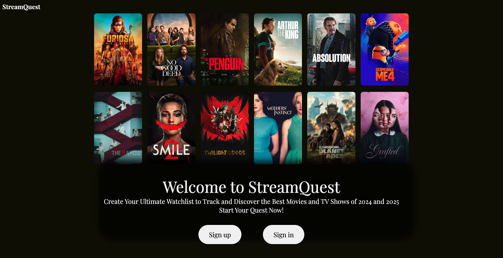
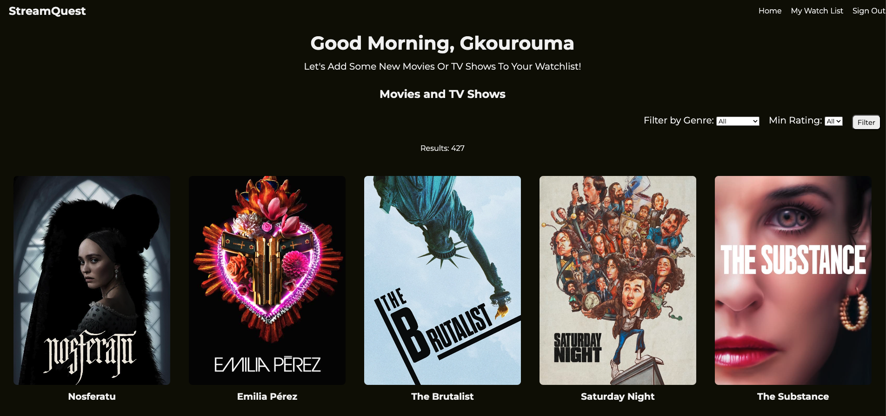
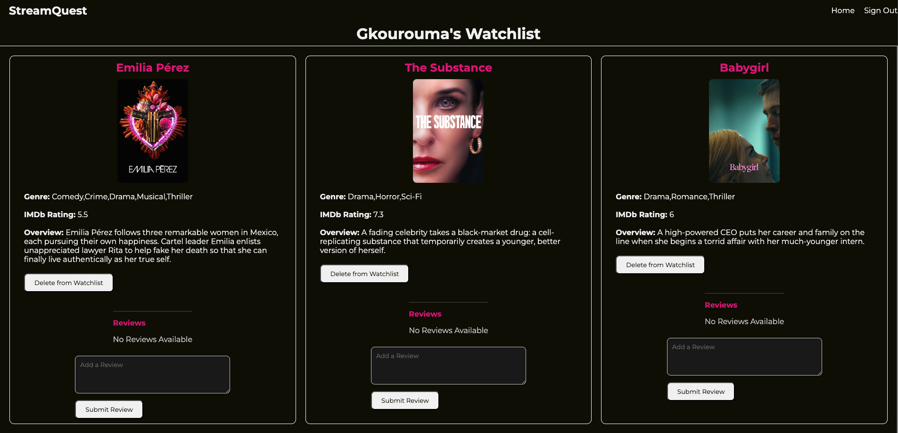

# StreamQuest 🍿

StreamQuest is a website where you can browse through movies and TV shows released in 2024 and early 2025. If something catches your eye, add it to your watchlist to watch later! You can also leave reviews and see what others think about the movies and shows on your list.

View [StreamQuest](https://streamquest-b32f111e5f9f.herokuapp.com/) now!

# For First Time Users

Once on landing page, you will have the option to sign up with your username and password. Once logged in, browse through the list of hundreds of titles and add the once that catches your eyes to your watchlist!

# Website Features
- Filter through movies and shows by genre and/or IMDb ratings
- Add movies and shows to your personal watchlist
- Delete unwanted titles from your watchlist
- Write and edit reviews on titles you've watched
- Read what other users think about the titles in your watchlist!

# StreamQuest Previews 

 

# Tech Used

- Frontend: EJS, CSS
- Backend: Node.js, Express
- Database: MongoDB(using data imported from Kaggle)
- Authentication: Session-Based Authentication
- Version Control: Git and GitHub

# Feature Updates

- Multiple Watchlists: Allow users to create and manage multiple watchlists
- Search Bar: Implement a search feature to find movies and TV shows by name
- Movie Trailers: Ability to view movie trailer on the app
- Reviews: Allow user to respond to and interact with other users reviews

# Attributions

- This project uses a data set originally sourced from [Sanad Alali](https://www.kaggle.com/sanadalali) on Kaggle, with credit to the original creator [Anand Shaw](https://www.kaggle.com/anandshaw2001) The data has been further cleaned and modified to include fields like Movie Posters and remove unwanted fields. You can access the original dataset [here](https://www.kaggle.com/datasets/sanadalali/imdb-2024-movies-and-tv-shows)

- The movie posters were sourced from [TMDb](https://www.themoviedb.org/), and credit is given to [TMDb](https://www.themoviedb.org/). All posters are subject to TMDb’s terms of use.

